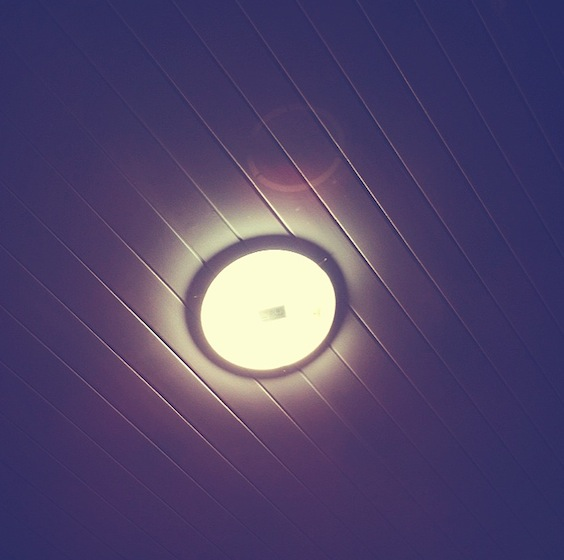
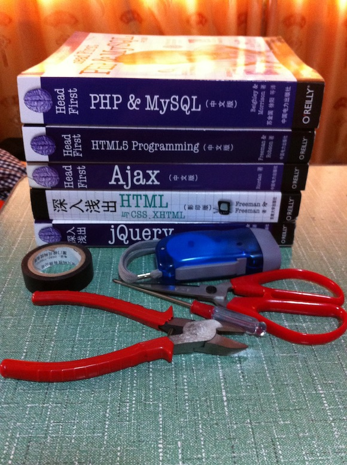
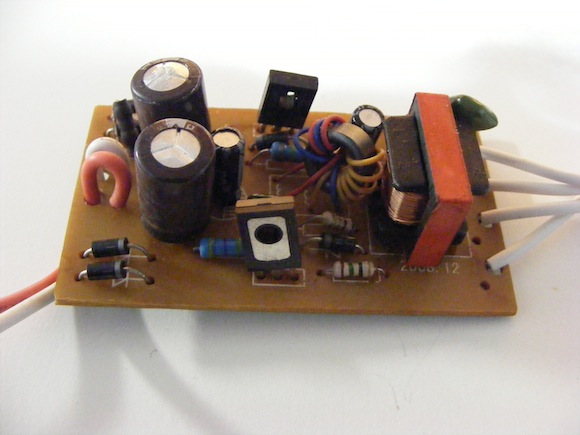
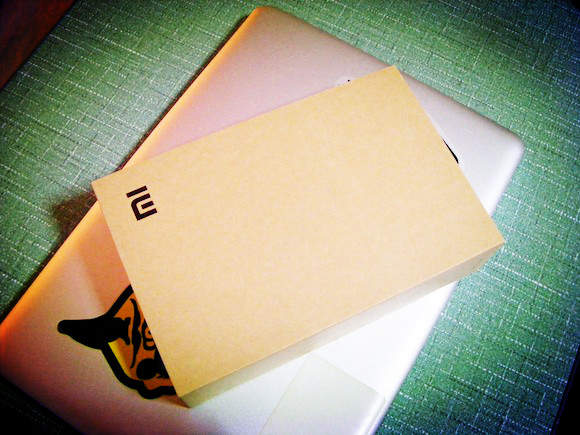
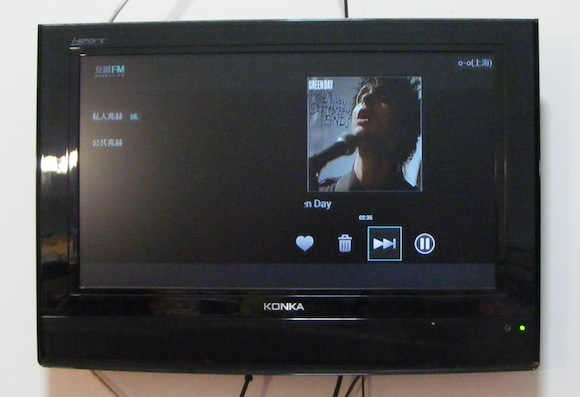

今天通过更换镇流器和灯管修好了家里的灯。瞬间觉得大学四年的物理还是有点用的。情况是这样的：

灯坏了 —— 拿出家里的一根老灯管接上 —— 老灯管闪啊闪 —— 怀疑问题出在镇流器上 —— 购买新的镇流器 ——安装新的镇流器—— 接上老灯管，依旧闪 —— 买新灯管 —— 接上 —— 灯修好了 —— 再度验证，的确旧灯管+ 旧镇流器均坏

修理的过程可把我的脖子累疼了，使用的工具如下：

五本 Head First系列的书 —— 垫脚用，即使站在床上距离天花板还有很大一段距离|||

钳子一枚

十字螺丝刀

剪刀一把

手电筒

不导电胶带

一个插线板

修好了灯的时候觉得还是很赞的！

拆开坏的镇流器感觉自己又在上模电课了｜｜｜

不过觉得自己真是从一个文艺女青年过渡到了生活女青年啊。

修灯，创造性的解决水斗堵塞问题…

不过总是有一大堆事等着去做，如果仔细算算，reminders里真的可以再增加许多todo…

在努力的给自己构建一个好的精神环境的同时也得非常努力的给自己构造一个好的生活环境。

另有一新玩具：小米盒子。

我觉得小米完全可以成为国人的骄傲。

非常漂亮的包装，关键是我觉得包装散发出一种优雅和香味。

使用起来也OK，如果你基本不看有线电视，那么就用小米盒子吧。

而且我又多了一个地方可以听豆瓣电台了。

Airplay 也很实用

Airplay这个协议以后也会成为新规范的吧

今天也有很多很多新的思维，新的想法产生于我脑中，需要找时间好好再度梳理。