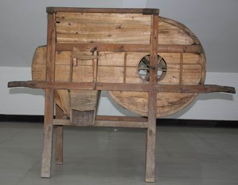
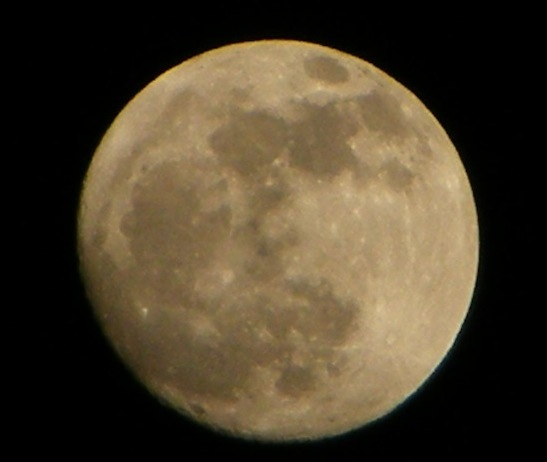

最近发生了很多事情，各种事情，所以也有一些思考。

让我们看到了许多天灾人祸。

问题一：

生命是谁给的？

问不同的人，会有很不同的答案。

生命是父母给的，生命是上帝给的，生命是真主给的。

在这次的地震中，我突然像所有信主的人一样，信自然了。

我觉得，生命是自然给的。生命是自然给的，父母是承载生命的载体。

当然，生命也是父母给的。

人类是非凡的高度进化了不起的物种。

但是人类也是动物: 生老病死。

虽然死亡是必然的，但是在我们的身体机能还未完全衰竭之前，天灾人祸都是概率。

很多时候，在事故中的那个人可能是我，也可能是你，可能是我们周围的任一人。

所以我们应该活得更洒脱开心一些。（怎么变心灵鸡汤文了。）

好像还是没有表达出我想表达的意思。

问题二：

死刑应该存在么？

问死刑应该存在与否这个问题的时候就会涉及第一个问题。生命是谁给的？生命为何物？

“法律是统治阶级的统治工具。” 这应该是我高中政治课学的。

那统治机器有权利剥夺人的生命与否？

人有权力自杀么？

自杀这件事情，我与很多人的意见一样，如果一个人是经过深思熟虑，那么他可以决定结束自己的生命的吧？

但是看电影的时候，看下一些人犯下的罪行，然后看到主角以暴制暴的时候还是感觉很畅快的。

即使是电影，记得有一度我还满会注意的，貌似我是一个多愁善感的菇凉。

有的时候看，我看到主角杀一些啰啰的时候，我也会想，这个啰啰说不定有孩子的。

其实主角可以打昏他。

完全脱离了整个影片的重点\|\|\|（喂！编剧希望你看的是主角多么的强壮英武好么\|\|\|）

问题三：

传统武侠中的报仇价值观是有大问题的？

这个问题问过几个人，做过几次设定，假设父母为大侠，小的时候父母被害，那么会替父母报仇么？

会有不同的分类设定：

父母： 好 坏

孩子： 婴儿 幼童

亲眼所见： 是 否

执行者： 私刑 执法机构

受教育： —– ——–

这样设定下去就会没完没了，好与坏的分类很暴力，比如如果他们是毒枭，但是他们从未杀过人，甚至还做慈善。但是他们间歇的造成了很多家破人亡，这是好人还是坏人？

亲眼看到自己熟悉的人被杀害逝去又是不一样的吧。

道德上我们知道一些事情，但不代表我们情感上能够接受一些事情。

这里还会涉及到很多问题，很多武侠小说中报仇这件事都会到下一代身上来，但是下一代其实关于一些事情完全就是无辜的。

A rape了B的女儿，B去rape A的女儿，这件事肯定也是不能接受的啊。因为就这件事来说，A的女儿是无辜的（暂不加其他的设定）。

假设A国的军队可能伤害了I国的民众，其实这就是不对的，为什么要去伤害民众？能和平就不要战争，能言和就不要流血，如果要战争，请尽量也仅在军队，但为什么要战争，没有正义的战争，没有正义的战争。

但是我们假设，假设这件事已经发生了，A国的军队伤害了I国的民众，即使这件事发生了，我觉得I国的民众也不应该不能去伤害A国的民众，因为甚至他们都可能不知道发生了什么事情。

民族主义是个奇怪的东西。

有时候是我们太敏感了么？

但是看一看以色列人想对伊朗人说的话：

http://www.israelovesiran.com/

还是很令人感到温暖的。

问题四：

生命可以衡量么？

一千个孩子的生命是大于两个孩子的么？

这是看了电影《Unthinkable》的问题，好电影，看的时候其实稍微都有一点猜到剧情的发展了。（果然因为犯罪分子也是物理系的人么？）

其实也比较容易想到：如果他已经设计好那么多事情，那么他的目的是怎样，再由他的目的可以推断出其实他到底是否有说谎。

谈判专家、FBI还真是难当啊。

什么是信仰？什么是迷途？

你会觉得一些人的生命比另外一些人的价值更高么？

其实貌似高中语文学的房龙的一篇文章有在尝试讨论这个问题。

好像可以去看哈佛公选课Justice了。

才发现，在一些地方。

道德困境比我们想象的多。

因为人是社会性的动物，所以一定就有的吧。

因为表达能力太有限度，所以只能表示对于编剧在剧中的一些设定，一些问题表示心有戚戚焉。

令：

昨天晚上一直梦到这个东西：

梦到回到小时候生活过的农村，想把它好好拍下来一直调大光圈因为想虚化背景却虚化失败，我的相机是有多想在梦中被我淘汰啊。

但是让我爱上自己的相机的方法真的也很简单，在一个月明星稀的夜晚去拍一下月亮就会觉得他好强大，环形山脉耶。

不过貌似很容易拍出这样的效果。

我爱你，月球 & 地球。

晚安，我爱的生活以及别的。