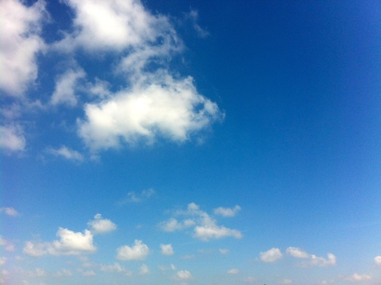

青春，

青春不该只有爱情。

青春的色调应该是怎样的？

至少，在所谓的青春时候，我们还没有被生活琐事累倒，还是相信爱情的，还是愿意谈论理想的。

整部片子最“青春”的时候应该是在朱小北（刘芸）砸学校小卖部的时候。

因为青春应该意味着反抗，意味着觉醒，意味着斗争。

其次应该也是在女主角上台唱《红日》的时候。

当然谁也不能给青春下定义。

朱小北的悲剧在是时代的悲剧，是还未遭受生活磨砺的悲剧。也的确是在自尊太高的悲剧。（是么？）

其实或许有更好的解决办法，比如告诉同学自己的不公平遭遇，比如煽动班级同学。（因为学生时代的我们应该是比较好煽动的。）

赵导应该借这部片子说出来了很多自己想说的话吧，比如“人生除了爱情还有很多别的。”

作为第一部作品，算一个好成绩了。

但感觉大陆拍青春片始终是比不过台湾的。

因为……………

因为台湾有桂纶镁。

因为台湾的青春片里元素可以多一点：

同志、政治

而青春，青春应该是诗多过词的年代，应该是现代诗多过古代诗的年代。

青春对我来说更多的是友谊，一点点爱情，一些话剧，一些觉醒，一些寂寞，#更多的时候是作为学霸而存在#

而对更多人来说，或许我们从未青春过。

在青春之前，我们已经老了。我们已经被上一代对我们的各种担心期望压垮了。

如果需要对大学时代的青春下一个定义，那么是阳光明媚的下午，阿杜骑着车带着我在校园里，阳光很好，就在校园里，什么都没有做，什么也没有要去做。

或许下一秒我们就会去小卖部买一个冰棍，或许下一秒我们就会坐公交车去附近玩，或许下一秒我们就会回寝室睡觉。或许下一秒我们会去河边坐着看书。

我想，那大概就是我的一部分青春了吧。

