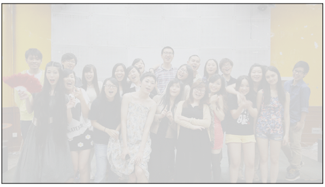

最近虽然有的时候睡眠时间很长，但都还是感觉很累，老了啊。

昨天做了一个梦，梦到大学最好的朋友在跟我一起玩，好像是读大学，又好像是在我家，但是突然到了要分离的时候了，我们拼命阻止，但还是无法阻挡时间流逝使我们分开。

突然觉得特别伤悲，然后又看了一部电影，看这部电影的影评的时候感慨：因为这是一部“录像厅时代”的电影。

“录像厅时代”：这个时代是可以付5角钱然后就在录像厅内看一部电影的时代。主要的为港产片，放映的主要以恐怖和带一点情色或者港式喜剧。小学的时候院子里的一个姐姐带我去看过，还记得放的是一部“僵尸片”，我又害怕又想看，她就捂住我的眼睛不让我看。不过我还是在偷偷的看，在录像厅看电影和在电影院的体验基本一样，大家都会一起发出害怕的叫声，一起笑，一起脸红，一起捂住弟弟妹妹的眼睛不让他们看一些镜头。

但是录像厅年代又比电影院年代好，也许是因为那个时候的电影审查制度吧。所以可以大可放一些擦边的电影。

那个时候，那个时候才才1996，1997吧。我才9，10岁吧。

时光催人老。只能朝后比啊，不能朝前比。

前几天还梦到了自己收到了复旦的大学通知书，2015级的，好像是本科生录取通知书，真是想年轻想疯了，还有，我是多喜欢复旦。

羡慕读书的孩纸们，总的来说，压力小一些，不用太为生计担心。（少数人另当别论。）

只是有一种很感伤的感觉，或许我只是担心的东西太多了，需要调整。又或许就是简单的很久没有晒太阳。

感觉自己越长越大，丢掉的东西越来越多。

不过最近开心的事情当然还是有的。

Such as：

When I’m with u.

Thank you guys for give me different experience of my life.

Really happy with u.

That’s also what I’m trying to seek, I think.

\\

For privacy, I used a mask.

