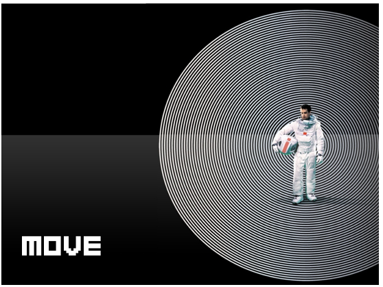

一、

“书书书书书书书衣服书书书书

生活用品书书书书书书书硬币书书

书书书护照书书电子元件书书书书

书书颜料书书书明信片书书书书

书书书杂志书
”

感觉自己真是像老学究啊，怎么都是书！

二、

搬家的时候是在豆瓣浦东租房小组找了一个搬家师傅，因为中介介绍的一个人再介绍的一个人实在不靠谱。

忘记问师傅是那里人了，但是我感觉是一个东北大汉。

身强力壮态度好。

最后我付给师傅的钱比之前订的多一些。

因为好人难得难找。

假装是洋派作风，给tips.

三、

跟之前的中介吵了一架。

最近情绪起伏比较大，我觉得其实自己算是一个讲理的人。

好像这是我今年第一次和人吵架。

所以能一直笑着的人还真是不容易啊。

要向能一直笑着的人学习。

无论心里觉得怎么无理，还是多笑笑，多开开玩笑。

或许就能缓解很多吧。

四、

Seems life just get harder and harder

Do not give me a chance to breathe

Just feel my tears more and more

\\

No one can takes away the sorrow

Cause the sorrow(my sorrow) lives in me

grows with me, they become stronger and stronger

\\

Perhaps one day, they’ll be strong than me

And then I can only live in the shadow of my sorrow

五、

搬家的时候也发现了好多自己以前买的东西，好多自己以前的爱好，比如：

纺织颜料、电子爱好者入门包、HTML相关书。

不知道我最终会成为怎样的人：

“You can’t connect the dots looking forward, you can only connect them looking backwards.”

最近又看到豆瓣学习型红人之一彭萦有做一个10khours的网站，很简单的创意，算实用的网站。

又根据豆瓣，想到了，其实我们除了电影、书、音乐。 “想看”、“看过”、“在看”。

其实事情也可以分“想做”、“做过”、“在做”。

六、

Stay with hobbies

It’s so important to have a hobby, a hobby is something creative that’s just for you. you don’t try to make money or get famous off it. you just do it because it makes you happy.

A hobby is something that gives but doesn’t take.

七、

MOLESKINE本子快要用完了，幸好有准备一个新的。

就让它继续帮我保存我的小情感小秘密小想法们吧。

