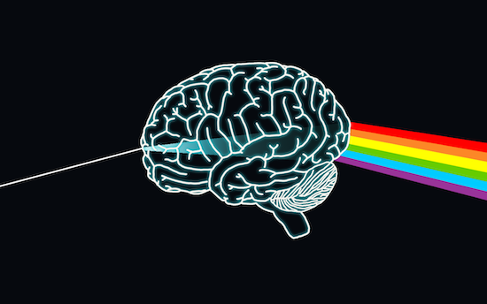

- 吐槽

先吐槽一下：

看到豆瓣上自己很喜欢的一个友邻吐槽，她比较讨厌的说话方式如下：

“艾玛我有时挺害怕那种中二玛丽苏的，说几句话然后自己再后面加上（笑）……尼玛要是明星采访也就算了就为的那种既视感，说话高冷或者阴阳怪气的（笑）个屁啊！！！想吓死谁啊一点都不好翘！！！笑个几把喔……（笑）”

我看到这条吐槽，也会在想，到底是要有多美的人，给自己说话还要配上表情，我感觉貌似应该只有林志玲类才会这样讲话吧……（笑）……不过这样来试试，还是很有趣呢……（笑）……

-

做人做久了（貌似自己以前是妖一样），总会提醒自己不忘初心。
我不知道对别人来说，初心这两个字是什么意思，或者意味着什么。
但对我来说，初心应该就是无论我发现自己是什么样的人，或者不是什么样的人，我活着的最初目的和乐趣应该都不会改变吧。

有的时候你会在思维上性格上推翻自己对自己的原有认识，会发现：咦！原来我不是那样的人，原来我是另一种人：原来我没有自己以为的那么看得开，原来我没有自己以为的那么身心健康，原来我没有自己以为的那样心态好，原来我没有自己以为的可以那么不在意别人的看法。

最阳光的那一面背后也许是最暗的地方，最极致的才华背后也许是最极致的疯癫。

无论你发现自己是什么样，多令自己满意或者不满意。但你也还是你，你和你喜欢的你，你和你讨厌的你，是共生的。

你可以做出一些改变，这些改变我乐观积极的相信是有用的。

但其实也会想，一些东西大概是被编程在我们的基因内的吧：比如我们会追寻意义，我们都对自然科学感到好奇。

换个思路，按照混沌动力学系统来看，应该是当我们处于一定的开放度的时候，这个系统应该是最有活力的。

这个年代已经老早都不流行艺术家疯狂，生活不规范检点了。
感觉现在艺术圈文艺圈流行的是看谁更接地气，生活规律，创作规律。作品的基数大了，用于创作思考的时间多了，杰作总会有的。

最重要的一点：经常使自己保持睡眠充足，精力充沛的环境下。

当然，如果实在无法做到，那就偶尔小憩或者与精力不是那么充沛的自己好好相处吧。

-

休假回了家，休假的日子当然是非常闲适、舒畅、具有老干部风格的。

最难能可贵的是有两天早上都早早起来和我妈一起去公园跑步。
在家的时候都会做一些老早就想做的事情，
比如联系老友、闲时画画、研究困扰自己很久的问题（fractals turbulence chaos）

闲适的时光是非常好的，因为每天做的事情都是driven by interests.

非常需要保持此种心态。

-
买了一个打印机，接在了airport express 上，还有大学时候买的打印纸（当时用来做草稿纸算题）也派上了用场。

打印原版书反正总比买原版书便宜吧，如果真的很想看一本书，实在也买不倒，下载pdf下来转mobi格式也转不好（那种类似高端清晰扫描版本的或者djvu格式的），那么就打印一些来看吧。

感觉英语真的是需要学好的，同意词条，wikipedia英文比中文内容多多了。
况且还有语音版的词条。

加油吧，骚年，继续完成自己的todo list吧。

“最重要的是想法。”

然则对大脑来说，尺寸不要紧，要紧的是它的表面积。

