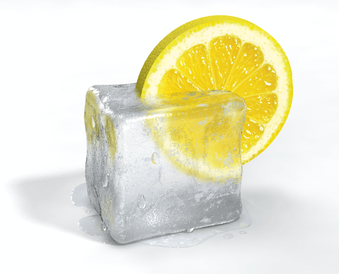

许多事情都已经告一段落了，好事。
可以继续自己的事情。

近日思潮感触：

- 《姐姐》

看快男看到了一个很厉害的人物叫“小强”，听到了他的两首歌：《平方根》，《姐姐》。
觉得非常厉害，听一听平方根里的词： 考试考第一、乒乓球第一、跑步跑第一？
绝对可以算三好生了，感人的部分在于这个曾经的三好少年长大了在广州的女人街卖鞋（七浦路）。我觉得更牛的地方在于卖鞋也好，怎样也好，这都是让我们生存下来的工作，我相信小强的工作他也是有从中得到许多乐趣的，因为感觉他的左邻右舍都为他加油嘛。说明平时工作氛围应该还很不错。

而小强的自我介绍也绝没有“我从小就喜欢XX”这类句式出现，真是让人觉得真棒！

爱好，hobbies，是来拯救我们的东西，它带给我们的乐应该比苦多很多。如果我们在我们的爱好上投入时间精力，那绝对是因为它让我们感到开心。爱好应该并不是我们想从中获得钱或者利的东西，只是应该因为我们喜欢这件事。爱好只给不拿。

然后听这首歌的时候也会感触，那些和我一起长大的人啊。那些和我一起分享了时间了的人们。

上一次回家有和我高中一个极好的朋友聊天，才发现我们其实可以有那么多重合的记忆、乐趣。我们分享了那么多。

如果问这段时间的我最爱的三首歌，那应该会是 《姐姐》.

宋东野也突然火了，这其实是令人欣慰的。

可能突然有一天，赵光、小河、张佺都会被更多人知道，也许有一天，民谣就会变成新的流行。

- 柠檬
家里买了两个柠檬，感觉在夏天，所有的饮品都可以加柠檬片和冰块，然后直接感觉level up.

比如可乐、雪碧、水。
喝起来真是太舒服了。

- 想法
想法才是最重要的，一个好的想法真的很重要，我们需要记下来它。

- 互联网
互联网的实质是分享，这个年代，如果你接入了互联网（最好不仅仅是大中华地区局域网），那么在很多领域，你就有了一手的最专业的知识。

- 理想
所谓理想，应该其实就是一些想法，可以是一些小的想法，但应该是积极的想法，这些想法能够给很多志同道合的人带来好处、带来乐趣、带来意思。

有的时候想到，如果能完全不在意别人的看法，那应该是一件多么幸福的事情啊。

杜尚说“拒绝和接受都是一样的”，不能太过严肃，太过认真，太过斗士，如果要斗争，可能就不能一边发笑了。

结束吧，睡一觉。趁着中暑的后遗症睡一觉，睡一觉就会更好的认识自己。

