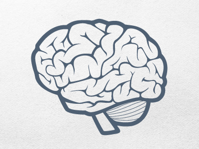

曾经看过一篇文章，关于人的大脑，大意是我们的大脑进化花了很长的时间。

所以人的大脑其实是 鳄鱼的大脑、猴子的大脑和人的大脑。

爬行动物层（本能反应）、哺乳动物层（情绪反应）、人（理智）。

所以还有这么一个精神分析的笑话：

在沙发上，现在睡了一只鳄鱼、一个猴子和一个精神病人。

很多人对待很多问题都会停留在前两层。

当然对待一些事情需要仅仅停留在前两层的。

这样省力。

但有些事情，我们得归还给智人的大脑来处理。

今天我好像也犯了同样的错误。把事情留在了情绪层，好像我有的时候经常会这样。是因为我是女人么？

但同样的，现在我发现以前做不到的，但是现在很多事情我又能把它带到理智层。（假装进步了）。

在人之所以进化为人的过程中，是需要付出巨大努力的。

是一些情况下是需要克制自己很多的本能反应、情绪反应的。

我想很多时候，很多事情，我应该能做的更好。

进食完毕，反省完毕。睡觉。

替那些把很多事情无法带到理智层的人上传两张来自网络的图片。

