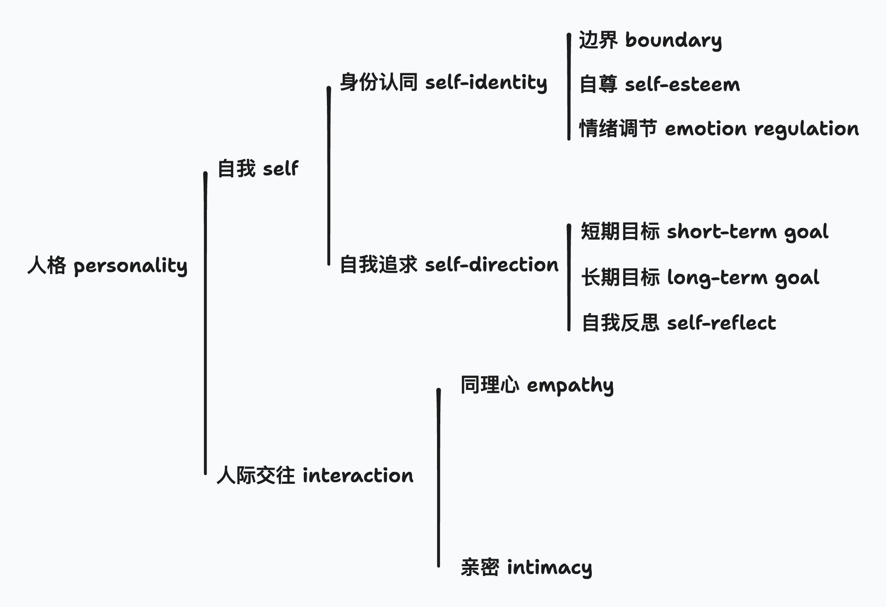

是看 [Is Anyone Normal?](https://www.youtube.com/watch?v=7r101wrP96Y) 的笔记📒，到底什么是正常？

人，或多或少都会有些毛病，但如果你的问题已经严重影响到你对自己的看法和人际相处，那就需要思考了。视频从两个维度探讨了人格（personality）的正常性：自我（self）和人际交往（relationship）。

自我可以分为两个方面：身份认同（self-identity）和自我追求（self-direction）。

身份认同又可以进一步分成：边界（boundary）、自尊（self-esteem）和情绪调节（emotion regulation）。

## 身份认同

### 边界

感觉其中任何一个话题都有大量的自助书籍。在健康的、正常的边界下，你能清晰地区分自己和他人，拥有独立的想法和观点。即使别人不同意你的观点，你也不会因此觉得需要改变自己的看法来迎合对方​​。如果存在病理问题，可能就是你无法拥有独立的观点，你的见解和情绪完全取决于周围人的看法和感受，而非源自于你自己​​。

我近年第一次接触【认真思考】这个概念是看到一个视频，妈妈教年幼的女儿，你的身体是属于自己的，grandma，grandpa，别的亲戚，甚至包括妈妈本人，如果我们想要和你hug/kiss，如果你在某些情况下不想要这些身体接触，你可以 say no，你觉得不舒服就可以 say no, thank you.

从来没人教过我这些东西，边界感。很多中国人大概以入侵别人的边界为乐。

我喜欢关于边界感的这个定义：
> At their very core, boundaries are the way we teach others to treat us. They are how communicate what is we acceptable and what is not. They define where you end and another person begins.

边界感告诉别人可以怎样对待我们，有哪些是我们可以接受，那些我们不可以接受，是我和别人的界线。我们需要边界来让我们免于操控、gaslighting、 PUA、不尊重和虐待。

“关你P事，关我P事”当然是边界。另外有一些更简单的 rule：

- 你有权 say no 然后不解释原因，no means no. 有人很nice的邀请你参加不喜欢的饭局/活动， 可以 say no 祝福别人吃的/玩的愉快，end，不需要解释更多。
- 你的边界不是固定的，可能会变，可能有些地方会比较 flexible，有些是坚定的边界/底线

### 自尊

自尊通常意味着你对自己有积极的看法，尽管可能会有一些自我批评。病理性的自尊可能表现为自我厌恶或自我夸大。自我厌恶是指对自己过于苛刻，有时甚至使用最贬低的词语来评价自己。自我夸大则表现为过分强调成功是自己的努力和决定，而将失败完全归咎于他人，缺乏客观洞察力​​。【无论是自我厌恶还是自我夸大，看待自己的视角都是扭曲的 distorted】

情绪调节方面，正常情况下，我们应该能够感受到各种情绪，无论积极还是消极。病态的话可能是无法表达一些强烈的情绪，或者无法适应自己拥有一些强烈的负面情绪，比如愤怒。他们既无法适应自己拥有愤怒的事实，也无法表达，然后会抑制这种情绪，这可能会变成消极攻击（passive aggressive）、焦虑或者沮丧。

## 自我追求

自我追求方面包括为自己设定短期和长期目标（short term、long term goal）以及自我反思（self-reflect）。

正常情况下，你可能会为了他人的认同而做一些事。但病理性的情况是，你无法建立或实现个人目标，可能时刻觉得生活毫无意义，这不仅仅是在情绪低落的时候，而是内心深信生活本身就是毫无意义的。

## 人际交往

人际交往方面包括同理心（empathy）和亲密（intimacy）。同理心是能否站在别人的角度看待问题，而亲密关系在世界上同样有大量自助类书籍。

【may expand some parts later】

---------------------------

## 正常 vs 不正常

因为我妈从小都会说我性格怪，所以我一直会要思考，到底什么是正常，也跟她聊过 “正常” vs “不正常”

1. 所谓的正常，正常可以是正常 normal，但也可以是平庸 mediocre。在一个班上，成绩好（有天分）的但有质疑精神的学生不一定会在老师那里得到好的评价，因为不好管理。但一个平庸的孩子可能就不会得到‘性格怪’的评价。

2. 社会需要的正常只是利于它的管理，东亚国家如此强调儒家孝道，这都是为了管理，比如生娃、买房、加班、消费、贷款，这些事情都是把你当做劳动力、消费力，生孩也只是为了让政权可以收割下一波韭菜。你不在这个范式之中，你可能就是不正常的。

3. 正常可能只是多数人的选择，南方吃米vs北方吃面，异性恋 vs 同性恋，而且一些正常可能都是被后天教出来的。

4. 正常可能跟所处的环境时代相关，同性恋在中国不正常，但在外国正常。古罗马皇族就近亲结婚正常，因为这样可以保证血脉的纯正。

5. 跟残疾人相比相比可能我们叫正常，但是可能很多人脑子里/精神世界残疾但是我们看不到，以为TA是个正常人，但其实TA是个需要帮助的人。

6. 连疾病都在去病化，比如自闭症都在说光谱...而不是病或者不正常

我要真实，何必正常。

Quotes

> “女生应该是什么样子？女生该怎么穿、怎么吃、怎么丢球？最普遍的男女厕符号，裤子对照着裙子。在习以为常的符号笼罩下，是符号反应了我们，还是我们活成了符号？不穿裙子的女生可以进女厕吗？穿裙子的男生可以进女厕吗？觉得自己灵魂装错身体的生理男性可以进女厕吗？手术做到一半但是身分证还没有更改的人，该走进什么厕所才会比较安心？

> 我怕烫，猫舌头，吃饭很秀气。从小到大，长辈很爱念我“只有吃饭像个女生”。好像放下筷子后，我就立地转性一样。筷子拿得远了，又要被说“以后会远嫁”，拿得近了，又说姿势不好。如同中原标准时间，女生好像也有个女生中央伍，必须时刻对齐。这里头学问可大了，从裙子的尺度到头发的长度，走路的弧度到坐姿的角度，就连胸部到底该收该放，该挤该束，时时刻刻都需要留心。最难的不是做不到，而是差一点。

> 要再大一点，大概高中，我接受自己是个有点奇怪的女生，更后来，我才发现我就是女生，不论头发长度或服装打扮，我就是一个长成这样的女生，想要以自己舒服的方式去生活。当我们说一个女生样的女生，甚至反过来，谈一个很man的男生，那些词汇都该被适当地摇晃，去动摇那个男男女女的概念，动摇那个所谓阳刚、阴柔、短发、长发的对立，让一切都可以更松脱。”

> "「很好笑吧，如果不能得到一個他們眼中『正常』的女兒，那至少要一個可以上名校的女兒。」小莫迅速擦掉眼淚「但是，考上台大或政大，仍售是我的首要目標，妳知道為什麼嗎？」
「為什麼？」
「因為這雨間學校有女同性戀社團，浪莲跟奇娃。」小莫打從心底笑了出來。
「浪達跟奇娃。」我複誦，像是記憶一句保命的咒文。”

